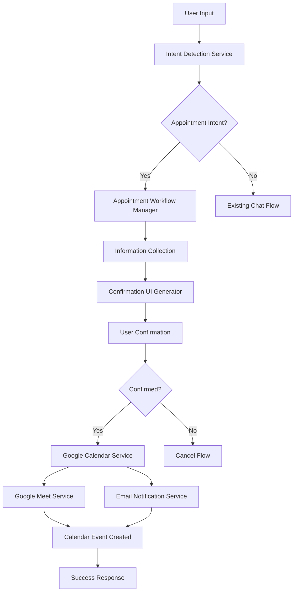

# Design Document - Appointment Booking Chatbot

## Overview

The appointment booking chatbot feature enables users to schedule appointments through natural language conversation with an eye-catching, interactive UI. The system integrates with Google Calendar and Google Meet to provide seamless appointment scheduling, confirmation, and notification capabilities.

The feature extends the existing chatbot infrastructure by adding appointment-specific intent detection, a multi-step booking workflow, and rich UI components for appointment confirmation.

## Architecture

### High-Level Architecture



### System Integration Points

1. **Intent Detection System**: Extends existing `IntentDetectionService` to recognize appointment booking requests
2. **Chat Application**: Integrates with existing FastAPI chat endpoints
3. **Google Services**: Utilizes existing Google Calendar integration and adds Google Meet functionality
4. **Frontend**: Enhances existing chat UI with rich appointment confirmation components
5. **Database**: Stores appointment data in existing user management system

## Components and Interfaces

### 1. Appointment Intent Detection

**File**: `app/appointment_intent_detection.py`

```python
class AppointmentIntentDetectionService:
    async def detect_appointment_intent(self, message: str) -> AppointmentIntent
    def extract_appointment_details(self, message: str) -> Dict[str, Any]
```

**Integration**: Extends existing `IntentDetectionService` pattern

### 2. Appointment Workflow Manager

**File**: `app/appointment_workflow_manager.py`

```python
class AppointmentWorkflowManager:
    async def start_appointment_booking(self, user_id: str, message: str) -> WorkflowResponse
    async def collect_missing_information(self, session: AppointmentSession) -> WorkflowResponse
    async def generate_confirmation_ui(self, session: AppointmentSession) -> ConfirmationUI
    async def process_confirmation(self, session_id: str, confirmed: bool) -> WorkflowResponse
```

### 3. Enhanced Google Calendar Service

**File**: `app/enhanced_calendar.py`

```python
class EnhancedCalendarService:
    async def create_appointment_with_meet(self, appointment_data: AppointmentData) -> CalendarEvent
    async def send_calendar_invitations(self, event: CalendarEvent, attendees: List[str]) -> bool
```

### 4. Google Meet Integration Service

**File**: `app/google_meet_service.py`

```python
class GoogleMeetService:
    async def create_meet_link(self, calendar_event_id: str) -> str
    async def add_meet_to_event(self, event_id: str, meet_link: str) -> bool
```

### 5. Email Notification Service

**File**: `app/email_notification_service.py`

```python
class EmailNotificationService:
    async def send_appointment_confirmation(self, appointment: AppointmentData) -> bool
    async def send_appointment_reminder(self, appointment: AppointmentData) -> bool
```

### 6. Appointment UI Components

**Frontend Files**: 
- `frontend/src/components/AppointmentConfirmation.tsx`
- `frontend/src/components/AppointmentCard.tsx`

```typescript
interface AppointmentConfirmationProps {
  appointment: AppointmentData;
  onConfirm: () => void;
  onCancel: () => void;
}
```

## Data Models

### AppointmentIntent
```python
@dataclass
class AppointmentIntent:
    is_appointment_request: bool
    confidence: float
    extracted_details: Dict[str, Any]
    missing_fields: List[str]
```

### AppointmentSession
```python
@dataclass
class AppointmentSession:
    session_id: str
    user_id: str
    status: AppointmentStatus
    collected_data: AppointmentData
    created_at: datetime
    updated_at: datetime
```

### AppointmentData
```python
@dataclass
class AppointmentData:
    title: str
    location: str
    date: datetime
    duration_minutes: int
    attendee_emails: List[str]
    description: Optional[str]
    meet_link: Optional[str]
```

### ConfirmationUI
```python
@dataclass
class ConfirmationUI:
    appointment_card: Dict[str, Any]
    action_buttons: List[Dict[str, Any]]
    styling: Dict[str, Any]
```

## Error Handling

### Graceful Degradation Strategy

1. **Google Meet Failure**: If Google Meet creation fails, proceed with calendar event creation and notify user
2. **Calendar Creation Failure**: Log error, notify user, but save appointment data for manual processing
3. **Email Notification Failure**: Log error but complete appointment booking
4. **Partial Information**: Guide user through information collection with helpful prompts

### Error Response Format

```python
@dataclass
class AppointmentError:
    error_type: str
    message: str
    recovery_action: Optional[str]
    user_message: str
```

### Error Types and Handling

- **MISSING_INFORMATION**: Continue workflow with information collection
- **CALENDAR_SERVICE_ERROR**: Fallback to manual calendar creation instructions
- **EMAIL_SERVICE_ERROR**: Complete booking but warn about notification failure
- **GOOGLE_MEET_ERROR**: Create calendar event without meet link, provide manual instructions

## Testing Strategy

### Unit Tests

1. **Intent Detection Tests**
   - Test appointment phrase recognition
   - Test detail extraction accuracy
   - Test confidence scoring

2. **Workflow Manager Tests**
   - Test information collection flow
   - Test confirmation UI generation
   - Test state management

3. **Service Integration Tests**
   - Test Google Calendar integration
   - Test Google Meet creation
   - Test email notification sending

### Integration Tests

1. **End-to-End Appointment Booking**
   - Complete booking flow from intent to confirmation
   - Test with various input formats
   - Test error recovery scenarios

2. **UI Component Tests**
   - Test appointment confirmation card rendering
   - Test button interactions
   - Test responsive design

### Test Data and Scenarios

```python
TEST_SCENARIOS = [
    {
        "input": "I want to book an appointment for tomorrow at 2pm",
        "expected_intent": True,
        "expected_details": {"date": "tomorrow", "time": "2pm"}
    },
    {
        "input": "Schedule a meeting with john@example.com at the office",
        "expected_intent": True,
        "expected_details": {"attendee": "john@example.com", "location": "office"}
    }
]
```

## UI/UX Design Specifications

### Appointment Confirmation Card

**Visual Design Elements:**
- Gradient background with modern color scheme
- Subtle drop shadows and rounded corners
- Animated transitions for state changes
- Icon-based visual hierarchy

**Layout Structure:**
```
┌─────────────────────────────────────┐
│  📅 Appointment Confirmation        │
│                                     │
│  📍 Location: [Office Address]      │
│  🕐 Date & Time: [Mon, Jan 15, 2pm] │
│  👥 Attendees: [email@example.com]  │
│                                     │
│  ┌─────────────┐ ┌─────────────┐    │
│  │ ✅ Confirm  │ │ ❌ Cancel   │    │
│  └─────────────┘ └─────────────┘    │
└─────────────────────────────────────┘
```

**Styling Specifications:**
- Primary color: #4F46E5 (Indigo)
- Success color: #10B981 (Emerald)
- Cancel color: #EF4444 (Red)
- Background: Linear gradient from #F8FAFC to #E2E8F0
- Font: Inter, system fonts
- Border radius: 12px
- Shadow: 0 4px 6px -1px rgba(0, 0, 0, 0.1)

### Animation and Interaction

1. **Card Entrance**: Slide up with fade-in effect (300ms ease-out)
2. **Button Hover**: Scale transform (1.05x) with color transition
3. **Confirmation Success**: Checkmark animation with green pulse
4. **Loading States**: Spinner with pulsing opacity

### Responsive Design

- **Desktop**: Full-width card with side-by-side buttons
- **Tablet**: Stacked layout with full-width buttons
- **Mobile**: Compact card with touch-optimized button sizes

## Security Considerations

### Data Protection
- Encrypt appointment data in transit and at rest
- Sanitize all user inputs to prevent injection attacks
- Implement rate limiting for appointment booking requests

### Authentication and Authorization
- Verify user identity before creating appointments
- Validate email addresses before sending invitations
- Implement session management for appointment workflows

### Google Services Security
- Use OAuth 2.0 for Google API authentication
- Implement proper scope management for calendar and meet access
- Store service account credentials securely

## Performance Considerations

### Optimization Strategies
- Cache Google Calendar service instances
- Implement async processing for email notifications
- Use connection pooling for database operations
- Optimize UI rendering with React.memo and useMemo

### Scalability
- Design for horizontal scaling of appointment workflows
- Implement queue-based processing for high-volume scenarios
- Use database indexing for appointment queries

## Monitoring and Analytics

### Key Metrics
- Appointment booking success rate
- Average time to complete booking flow
- User drop-off points in the workflow
- Google services integration success rates

### Logging Strategy
- Log all appointment booking attempts
- Track user interaction patterns
- Monitor service integration failures
- Implement structured logging for debugging