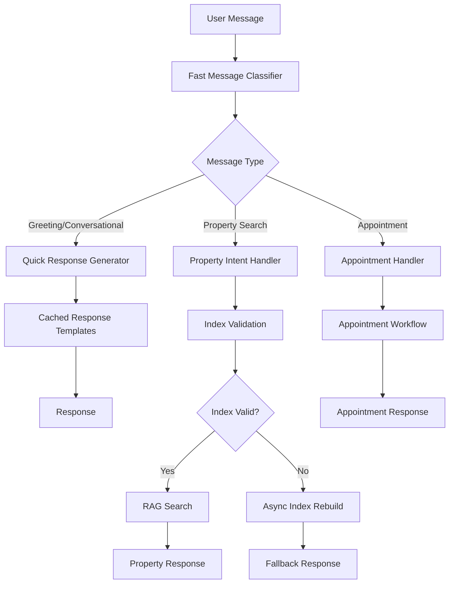

# Design Document

## Overview

The chatbot performance optimization addresses critical issues in the current system where simple greetings trigger expensive property search workflows, causing 54+ second response times and inappropriate responses. The solution implements intelligent message classification, response caching, and optimized processing flows to ensure fast, contextually appropriate responses.

## Architecture

### Current Issues Analysis

Based on the code analysis, the main performance bottlenecks are:

1. **Intent Detection Failures**: LLM-based intent detection fails with JSON parsing errors, causing fallback to expensive RAG workflows
2. **Unnecessary Index Rebuilding**: User indices are rebuilt on every request when they should be cached
3. **No Conversational Intent Handling**: Simple greetings trigger full property search workflows
4. **Synchronous Processing**: Heavy operations block response generation

### Proposed Architecture



## Components and Interfaces

### 1. Fast Message Classifier

**Purpose**: Quickly categorize messages without expensive LLM calls

**Interface**:
```python
class FastMessageClassifier:
    def classify_message(self, message: str) -> MessageType
    def is_greeting(self, message: str) -> bool
    def is_property_query(self, message: str) -> bool
    def get_confidence(self) -> float
```

**Implementation Strategy**:
- Rule-based pattern matching for common greetings
- Keyword detection for property-related terms
- Fallback to LLM only when patterns are ambiguous
- Response time target: <100ms

### 2. Conversational Response Handler

**Purpose**: Handle non-property related conversations efficiently

**Interface**:
```python
class ConversationalHandler:
    def handle_greeting(self, message: str, user_id: str) -> str
    def handle_thanks(self, message: str) -> str
    def handle_general_chat(self, message: str) -> str
```

**Response Templates**:
- Greeting responses with personalization
- Help offers that guide users to property searches
- Contextual responses based on user history

### 3. Index Management Optimizer

**Purpose**: Prevent unnecessary index rebuilding and improve caching

**Interface**:
```python
class IndexManager:
    def get_cached_index(self, user_id: str) -> Optional[VectorStoreIndex]
    def validate_index_health(self, user_id: str) -> bool
    def schedule_async_rebuild(self, user_id: str) -> None
    def is_rebuild_needed(self, user_id: str) -> bool
```

**Optimization Strategy**:
- Index health validation before expensive operations
- Asynchronous rebuilding that doesn't block current requests
- Smart caching with TTL and validation
- Graceful degradation when indices are unavailable

### 4. Response Time Monitor

**Purpose**: Track and alert on performance issues

**Interface**:
```python
class ResponseTimeMonitor:
    def start_timer(self, operation: str) -> str
    def end_timer(self, timer_id: str) -> float
    def log_slow_operation(self, operation: str, duration: float) -> None
    def get_performance_metrics(self) -> Dict[str, Any]
```

## Data Models

### Message Classification

```python
@dataclass
class MessageClassification:
    message_type: MessageType
    confidence: float
    processing_strategy: ProcessingStrategy
    estimated_response_time: float
    requires_index: bool
```

### Performance Metrics

```python
@dataclass
class PerformanceMetrics:
    operation_name: str
    start_time: float
    end_time: float
    duration_ms: float
    success: bool
    user_id: Optional[str]
    message_type: Optional[str]
```

## Error Handling

### Intent Detection Failures

**Current Issue**: JSON parsing errors in LLM responses cause system to fall back to expensive operations

**Solution**:
1. Implement robust JSON parsing with error recovery
2. Add rule-based fallback classification
3. Log specific error types for monitoring
4. Provide default classifications for common failure cases

### Index Unavailability

**Current Issue**: Missing indices cause long rebuild times that block responses

**Solution**:
1. Validate index health before expensive operations
2. Provide immediate fallback responses while rebuilding asynchronously
3. Implement graceful degradation for users without documents
4. Cache validation results to avoid repeated checks

### Performance Degradation

**Solution**:
1. Circuit breaker pattern for slow operations
2. Timeout enforcement on all external calls
3. Fallback to cached responses when operations exceed thresholds
4. Automatic scaling of processing strategies based on load

## Testing Strategy

### Unit Tests

1. **Fast Message Classifier Tests**
   - Pattern matching accuracy for greetings
   - Property query detection precision
   - Edge cases and ambiguous messages
   - Performance benchmarks (<100ms target)

2. **Conversational Handler Tests**
   - Response appropriateness for different greeting types
   - Personalization with user context
   - Template rendering and formatting

3. **Index Manager Tests**
   - Cache hit/miss scenarios
   - Health validation accuracy
   - Async rebuild coordination
   - Error recovery mechanisms

### Integration Tests

1. **End-to-End Response Time Tests**
   - Greeting messages under 2 seconds
   - Property queries under 5 seconds
   - Performance under concurrent load
   - Memory usage optimization

2. **Fallback Behavior Tests**
   - Intent detection failure scenarios
   - Index unavailability handling
   - Network timeout recovery
   - Graceful degradation validation

### Performance Tests

1. **Load Testing**
   - Concurrent user simulation
   - Response time distribution analysis
   - Memory and CPU usage monitoring
   - Cache effectiveness measurement

2. **Stress Testing**
   - High message volume handling
   - Resource exhaustion scenarios
   - Recovery time measurement
   - System stability validation

## Implementation Phases

### Phase 1: Fast Message Classification
- Implement rule-based greeting detection
- Add conversational response templates
- Create performance monitoring infrastructure
- Target: 90% of greetings respond in <2 seconds

### Phase 2: Index Management Optimization
- Implement index health validation
- Add asynchronous rebuild capabilities
- Optimize caching strategies
- Target: Eliminate unnecessary rebuilds

### Phase 3: Error Handling Enhancement
- Robust intent detection with fallbacks
- Improved error logging and monitoring
- Circuit breaker implementation
- Target: 99% uptime with graceful degradation

### Phase 4: Performance Monitoring
- Comprehensive metrics collection
- Real-time performance dashboards
- Automated alerting for slow operations
- Target: <5 second response time for 95% of requests