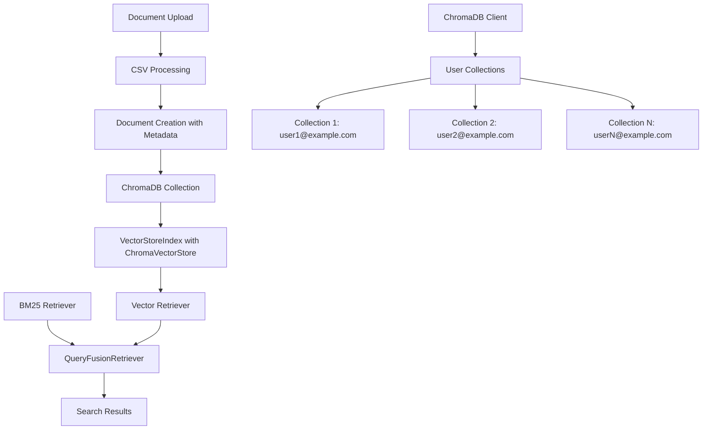

# Design Document

## Overview

This design outlines the integration of ChromaDB as the persistent vector store for the Okada Leasing Agent's RAG system. The integration will replace the current in-memory VectorStoreIndex with ChromaDB's persistent storage while maintaining compatibility with the existing hybrid search architecture.

## Architecture

### Current Architecture
- In-memory VectorStoreIndex with documents rebuilt on startup
- BM25Retriever for keyword search
- QueryFusionRetriever combining vector and keyword search
- Global variables `rag_index` and `bm25_retriever`

### New Architecture with ChromaDB
- ChromaVectorStore as the persistent backend for VectorStoreIndex
- User-specific ChromaDB collections for multi-tenant support
- Persistent storage with automatic collection management
- Enhanced metadata filtering using ChromaDB capabilities



## Components and Interfaces

### 1. ChromaDB Configuration
- **Location**: `app/config.py`
- **Purpose**: Add ChromaDB-specific configuration settings
- **Interface**:
  ```python
  class Settings(BaseSettings):
      # Existing settings...
      CHROMA_PERSIST_DIRECTORY: str = "./user_chroma_db"
      CHROMA_HOST: Optional[str] = None
      CHROMA_PORT: Optional[int] = None
      CHROMA_COLLECTION_PREFIX: str = "okada_user_"
  ```

### 2. ChromaDB Client Manager
- **Location**: `app/chroma_client.py` (new file)
- **Purpose**: Manage ChromaDB client lifecycle and collection operations
- **Interface**:
  ```python
  class ChromaClientManager:
      def __init__(self)
      async def get_client() -> chromadb.Client
      async def get_or_create_collection(user_id: str) -> chromadb.Collection
      async def delete_user_collection(user_id: str) -> bool
      def close_client()
  ```

### 3. Enhanced RAG Module
- **Location**: `app/rag.py` (modified)
- **Purpose**: Integrate ChromaVectorStore with existing RAG functionality
- **Key Changes**:
  - Replace global `rag_index` with user-specific ChromaDB collections
  - Modify `build_index_from_paths()` to use ChromaVectorStore
  - Add collection management for multi-user support
  - Maintain backward compatibility with existing search interface

### 4. User-Specific Index Management
- **Purpose**: Handle per-user document collections
- **Interface**:
  ```python
  async def get_user_index(user_id: str) -> VectorStoreIndex
  async def build_user_index(user_id: str, file_paths: List[str]) -> VectorStoreIndex
  async def clear_user_index(user_id: str) -> bool
  ```

## Data Models

### ChromaDB Collection Schema
```python
# Collection naming convention
collection_name = f"okada_user_{hash(user_email)}"

# Document metadata structure
metadata = {
    "user_id": str,           # User email
    "file_name": str,         # Source CSV filename
    "row_index": int,         # Row number in CSV
    "property_address": str,  # Standardized property address
    "monthly_rent": float,    # Numeric rent for filtering
    "size_sf": float,        # Property size for filtering
    "upload_timestamp": str,  # ISO timestamp
    # Additional CSV columns as metadata
}

# Document content
document_text = "property address: 123 Main St, monthly rent: 2500, size (sf): 1200, ..."
```

### Configuration Model
```python
@dataclass
class ChromaConfig:
    persist_directory: str
    host: Optional[str] = None
    port: Optional[int] = None
    collection_prefix: str = "okada_user_"
    
    @property
    def is_remote(self) -> bool:
        return self.host is not None and self.port is not None
```

## Error Handling

### Connection Failures
- **Scenario**: ChromaDB server unavailable or connection timeout
- **Handling**: 
  - Log error with details
  - Fallback to in-memory VectorStoreIndex for current session
  - Return HTTP 503 with clear error message
  - Retry connection on next request

### Collection Errors
- **Scenario**: Collection creation/access failures
- **Handling**:
  - Attempt to recreate collection
  - Clear corrupted data if necessary
  - Provide user feedback about re-indexing requirement

### Data Consistency
- **Scenario**: Partial document uploads or indexing failures
- **Handling**:
  - Implement transaction-like behavior for batch operations
  - Rollback on failures
  - Maintain indexing status tracking

## Testing Strategy

### Unit Tests
- ChromaDB client connection and configuration
- Collection creation and management
- Document indexing and retrieval
- Metadata filtering functionality
- Error handling scenarios

### Integration Tests
- End-to-end document upload and search workflow
- Multi-user collection isolation
- Hybrid search with ChromaDB + BM25
- Performance comparison with in-memory implementation

### Performance Tests
- Index creation time for large CSV files
- Search response times with different collection sizes
- Memory usage comparison
- Concurrent user scenarios

### Environment Tests
- Local file-based ChromaDB setup
- Remote ChromaDB server connection
- Configuration validation
- Migration from existing data

## Migration Strategy

### Phase 1: Parallel Implementation
- Implement ChromaDB alongside existing in-memory system
- Add feature flag to switch between implementations
- Validate functionality parity

### Phase 2: Data Migration
- Create migration script for existing user documents
- Preserve user-specific document associations
- Maintain backward compatibility

### Phase 3: Full Transition
- Switch default implementation to ChromaDB
- Remove in-memory fallback code
- Update documentation and deployment guides

## Performance Considerations

### Indexing Performance
- Batch document insertion for large CSV files
- Async operations to prevent blocking
- Progress tracking for long-running operations

### Search Performance
- Optimize ChromaDB collection settings
- Implement result caching where appropriate
- Monitor query performance metrics

### Storage Efficiency
- Configure appropriate embedding dimensions
- Implement collection cleanup for deleted users
- Monitor disk usage growth