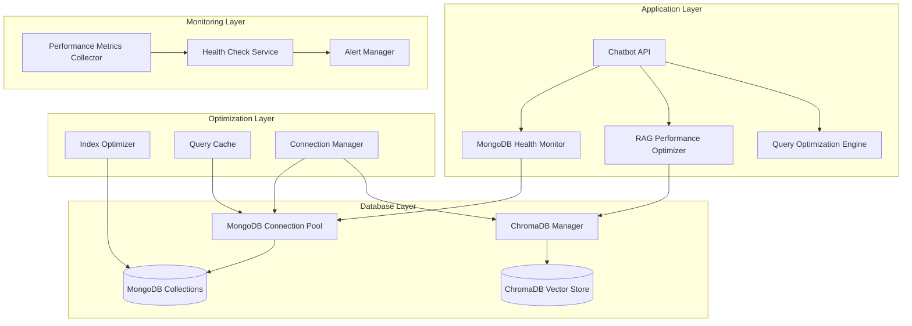

# Design Document

## Overview

This design outlines a comprehensive MongoDB RAG optimization system that audits, monitors, and optimizes the integration between MongoDB, ChromaDB vector storage, and the RAG-powered chatbot. The system addresses performance bottlenecks, data consistency issues, and provides real-time monitoring capabilities to ensure optimal operation under concurrent load.

The current architecture uses MongoDB for user data, conversation history, and application state, while ChromaDB handles vector embeddings for RAG operations. This dual-database approach requires careful optimization to maintain performance and consistency.

## Architecture

### Current System Analysis

The existing system architecture consists of:

1. **MongoDB Layer** (`app/database.py`)
   - AsyncIOMotorClient for async operations
   - Single database connection with connection pooling
   - Collections: users, conversations, companies, workflow sessions

2. **ChromaDB Vector Store** (`app/chroma_client.py`)
   - User-specific collections with MD5 hashed names
   - Local persistent storage with connection pooling
   - Collection caching with TTL-based expiration

3. **RAG System** (`app/rag.py`)
   - User-specific indexes with fallback mechanisms
   - Multi-strategy search with BM25 and vector similarity
   - Performance monitoring integration

### Proposed Optimization Architecture



## Components and Interfaces

### 1. MongoDB Health Monitor

**Purpose**: Continuously monitor MongoDB performance, connection health, and query patterns.

**Interface**:
```python
class MongoDBHealthMonitor:
    async def check_connection_health(self) -> HealthStatus
    async def analyze_query_performance(self) -> QueryPerformanceReport
    async def monitor_collection_stats(self) -> CollectionStatsReport
    async def detect_slow_queries(self, threshold_ms: int = 100) -> List[SlowQuery]
    async def optimize_indexes(self) -> IndexOptimizationResult
```

**Key Features**:
- Real-time connection monitoring with automatic failover
- Query performance analysis with execution time tracking
- Collection size and growth monitoring
- Automatic index recommendation based on query patterns
- Connection pool optimization

### 2. RAG Performance Optimizer

**Purpose**: Optimize RAG operations, vector search performance, and ChromaDB integration.

**Interface**:
```python
class RAGPerformanceOptimizer:
    async def optimize_vector_search(self, user_id: str) -> OptimizationResult
    async def validate_embeddings_integrity(self, user_id: str) -> ValidationResult
    async def optimize_collection_structure(self, user_id: str) -> StructureOptimizationResult
    async def benchmark_retrieval_performance(self, user_id: str) -> BenchmarkResult
    async def cleanup_stale_embeddings(self, user_id: str) -> CleanupResult
```

**Key Features**:
- Vector search performance tuning
- Embedding quality validation
- Collection structure optimization
- Retrieval latency benchmarking
- Automatic cleanup of orphaned data

### 3. Concurrent Operations Manager

**Purpose**: Handle multiple simultaneous RAG queries and chatbot interactions efficiently.

**Interface**:
```python
class ConcurrentOperationsManager:
    async def handle_concurrent_queries(self, queries: List[QueryRequest]) -> List[QueryResult]
    async def manage_connection_pool(self) -> ConnectionPoolStatus
    async def implement_query_queuing(self, query: QueryRequest) -> QueuePosition
    async def load_balance_requests(self, requests: List[Request]) -> List[BalancedRequest]
    async def monitor_resource_usage(self) -> ResourceUsageReport
```

**Key Features**:
- Intelligent query queuing and prioritization
- Dynamic connection pool scaling
- Load balancing across database connections
- Resource usage monitoring and throttling
- Deadlock detection and prevention

### 4. Security and Compliance Manager

**Purpose**: Ensure secure access to MongoDB and compliance with data protection requirements.

**Interface**:
```python
class SecurityComplianceManager:
    async def validate_connection_security(self) -> SecurityStatus
    async def encrypt_sensitive_data(self, data: Dict) -> EncryptedData
    async def audit_access_patterns(self) -> AccessAuditReport
    async def detect_anomalous_access(self) -> AnomalyReport
    async def ensure_data_compliance(self) -> ComplianceReport
```

**Key Features**:
- Connection encryption validation
- Data-at-rest encryption for sensitive fields
- Comprehensive access logging and auditing
- Anomaly detection for security threats
- GDPR/CCPA compliance monitoring

## Data Models

### Performance Metrics Schema

```python
@dataclass
class PerformanceMetrics:
    timestamp: datetime
    operation_type: str
    duration_ms: float
    success: bool
    user_id: Optional[str]
    collection_name: Optional[str]
    query_pattern: Optional[str]
    resource_usage: Dict[str, float]
    error_details: Optional[str]

@dataclass
class HealthStatus:
    overall_status: str  # healthy, degraded, unhealthy
    mongodb_status: DatabaseStatus
    chromadb_status: VectorStoreStatus
    connection_pool_status: ConnectionPoolStatus
    last_check: datetime
    issues: List[HealthIssue]
    recommendations: List[str]
```

### Optimization Results Schema

```python
@dataclass
class OptimizationResult:
    optimization_type: str
    before_metrics: PerformanceMetrics
    after_metrics: PerformanceMetrics
    improvements: Dict[str, float]
    applied_optimizations: List[str]
    recommendations: List[str]
    timestamp: datetime
```

### MongoDB Collection Optimization

**Enhanced User Collection Schema**:
```python
# Optimized indexes for user collection
{
    "_id": ObjectId,
    "email": str,  # Index: unique
    "full_name": str,
    "company_id": ObjectId,  # Index: compound with email
    "preferences": dict,
    "recommendation_history": [str],  # Index: sparse
    "appointment_history": [str],  # Index: sparse
    "created_at": datetime,  # Index: TTL for cleanup
    "updated_at": datetime,  # Index: for recent activity queries
    "last_activity": datetime  # Index: for user activity monitoring
}
```

**Optimized Conversation History Schema**:
```python
# Enhanced for better query performance
{
    "_id": ObjectId,
    "user_email": str,  # Index: compound with created_at
    "session_id": str,  # Index: unique
    "messages": [ChatMessage],
    "tags": [str],  # Index: multikey for tag-based queries
    "created_at": datetime,  # Index: compound with user_email
    "updated_at": datetime,
    "message_count": int,  # Denormalized for quick stats
    "total_tokens": int,  # For usage tracking
    "performance_metrics": PerformanceMetrics  # Embedded metrics
}
```

## Error Handling

### MongoDB Error Recovery

```python
class MongoDBErrorHandler:
    async def handle_connection_failure(self, error: Exception) -> RecoveryResult:
        """Handle MongoDB connection failures with automatic retry and failover."""
        
    async def handle_query_timeout(self, query: str, timeout_ms: int) -> TimeoutResult:
        """Handle slow queries with optimization suggestions."""
        
    async def handle_index_corruption(self, collection: str) -> IndexRepairResult:
        """Detect and repair corrupted indexes."""
        
    async def handle_disk_space_issues(self) -> DiskSpaceResult:
        """Monitor and handle disk space issues."""
```

### ChromaDB Error Recovery

```python
class ChromaDBErrorHandler:
    async def handle_collection_corruption(self, user_id: str) -> RepairResult:
        """Detect and repair corrupted ChromaDB collections."""
        
    async def handle_embedding_inconsistency(self, user_id: str) -> ConsistencyResult:
        """Fix embedding inconsistencies and missing vectors."""
        
    async def handle_storage_issues(self) -> StorageResult:
        """Handle ChromaDB storage and persistence issues."""
```

### Fallback Mechanisms

1. **MongoDB Fallback**: In-memory caching for critical user data
2. **ChromaDB Fallback**: Temporary in-memory vector storage
3. **RAG Fallback**: Simplified keyword-based search when vector search fails
4. **Chatbot Fallback**: Pre-defined responses when RAG system is unavailable

## Testing Strategy

### Performance Testing

1. **Load Testing**
   - Simulate 100+ concurrent users
   - Test query response times under load
   - Validate connection pool behavior
   - Monitor resource usage patterns

2. **Stress Testing**
   - Test system limits with extreme loads
   - Validate error handling under stress
   - Test recovery mechanisms
   - Monitor memory and CPU usage

3. **Endurance Testing**
   - Run system for extended periods (24+ hours)
   - Monitor for memory leaks
   - Test connection stability
   - Validate cleanup mechanisms

### Integration Testing

1. **MongoDB-ChromaDB Integration**
   - Test data consistency between systems
   - Validate user data synchronization
   - Test concurrent access patterns
   - Verify transaction handling

2. **RAG-Chatbot Integration**
   - Test end-to-end conversation flows
   - Validate context retrieval accuracy
   - Test response generation performance
   - Monitor user experience metrics

### Security Testing

1. **Access Control Testing**
   - Validate user isolation
   - Test authentication mechanisms
   - Verify authorization patterns
   - Test data encryption

2. **Vulnerability Testing**
   - Test for injection attacks
   - Validate input sanitization
   - Test connection security
   - Monitor for data leaks

### Monitoring and Alerting

1. **Real-time Dashboards**
   - MongoDB performance metrics
   - ChromaDB health status
   - RAG operation statistics
   - User activity patterns

2. **Automated Alerts**
   - Performance degradation alerts
   - Error rate threshold alerts
   - Resource usage warnings
   - Security anomaly alerts

3. **Reporting**
   - Daily performance reports
   - Weekly optimization summaries
   - Monthly trend analysis
   - Quarterly capacity planning

### Implementation Phases

**Phase 1: Foundation** (Monitoring & Health Checks)
- Implement basic health monitoring
- Set up performance metrics collection
- Create alerting infrastructure
- Establish baseline performance metrics

**Phase 2: Optimization** (Performance Improvements)
- Implement query optimization
- Optimize connection pooling
- Enhance caching mechanisms
- Improve error handling

**Phase 3: Scaling** (Concurrent Operations)
- Implement advanced queuing
- Add load balancing
- Optimize resource management
- Enhance security measures

**Phase 4: Intelligence** (Predictive Optimization)
- Add predictive analytics
- Implement auto-scaling
- Create intelligent caching
- Develop proactive maintenance