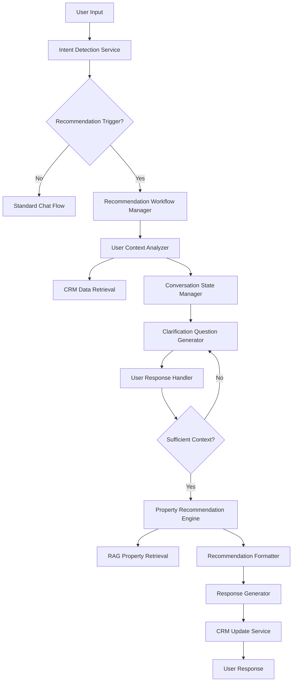

# Design Document

## Overview

The Smart Property Recommendations feature transforms the existing chatbot from a reactive Q&A system into a proactive, intelligent property recommendation engine. The system will detect natural language triggers, analyze user context from CRM data, engage in conversational clarification, and provide personalized property suggestions using the existing RAG infrastructure.

The design leverages the current FastAPI backend, ChromaDB vector storage, CRM system, and LLM integration while adding new components for intent detection, conversation management, and recommendation logic.

## Architecture

### High-Level Architecture



### Component Integration

The new recommendation system integrates with existing components:

- **FastAPI Main App**: New endpoint handlers for recommendation workflow
- **RAG Module**: Leverages existing `retrieve_context_optimized` for property search
- **CRM Module**: Uses existing user profile management and adds preference tracking
- **LLM Integration**: Extends current Gemini integration for intent detection and response generation
- **ChromaDB**: Utilizes existing user-specific collections for property data

## Components and Interfaces

### 1. Intent Detection Service

**Purpose**: Identifies when user input should trigger the recommendation workflow

**Interface**:
```python
class IntentDetectionService:
    async def detect_recommendation_intent(self, message: str) -> RecommendationIntent
    async def extract_initial_preferences(self, message: str) -> Dict[str, Any]
```

**Implementation**:
- Uses LLM-based classification to identify recommendation triggers
- Patterns: "suggest me a property", "find me an apartment", "any listings for me"
- Extracts any initial preferences mentioned in the trigger message

### 2. Recommendation Workflow Manager

**Purpose**: Orchestrates the entire recommendation process from trigger to completion

**Interface**:
```python
class RecommendationWorkflowManager:
    async def start_recommendation_workflow(self, user_id: str, initial_message: str) -> WorkflowSession
    async def process_user_response(self, session_id: str, response: str) -> WorkflowStep
    async def complete_workflow(self, session_id: str) -> RecommendationResult
```

**Implementation**:
- Manages workflow state and progression
- Coordinates between different services
- Handles error recovery and fallback scenarios

### 3. User Context Analyzer

**Purpose**: Analyzes user history and preferences to inform recommendations

**Interface**:
```python
class UserContextAnalyzer:
    async def analyze_user_context(self, user_id: str) -> UserContext
    async def identify_missing_preferences(self, context: UserContext) -> List[str]
    async def merge_new_preferences(self, user_id: str, new_prefs: Dict[str, Any]) -> UserContext
```

**Implementation**:
- Retrieves user profile from CRM
- Analyzes conversation history for implicit preferences
- Identifies gaps in user preference data

### 4. Conversation State Manager

**Purpose**: Manages the conversational flow and state during recommendation process

**Interface**:
```python
class ConversationStateManager:
    async def create_session(self, user_id: str, initial_context: UserContext) -> ConversationSession
    async def update_session(self, session_id: str, user_response: str) -> ConversationSession
    async def get_next_question(self, session: ConversationSession) -> Optional[str]
```

**Implementation**:
- Tracks conversation state and progress
- Determines when sufficient information is gathered
- Manages question sequencing and context

### 5. Property Recommendation Engine

**Purpose**: Generates personalized property recommendations using RAG and user context

**Interface**:
```python
class PropertyRecommendationEngine:
    async def generate_recommendations(self, user_context: UserContext, max_results: int = 3) -> List[PropertyRecommendation]
    async def explain_recommendation(self, property: PropertyRecommendation, user_context: UserContext) -> str
```

**Implementation**:
- Constructs search queries based on user preferences
- Uses existing RAG system for property retrieval
- Ranks and filters results based on user context
- Generates explanations for each recommendation

## Data Models

### Core Data Models

```python
@dataclass
class RecommendationIntent:
    is_recommendation_request: bool
    confidence: float
    initial_preferences: Dict[str, Any]
    trigger_phrases: List[str]

@dataclass
class UserContext:
    user_id: str
    historical_preferences: Dict[str, Any]
    budget_range: Optional[Tuple[int, int]]
    preferred_locations: List[str]
    required_features: List[str]
    excluded_features: List[str]
    last_updated: datetime

@dataclass
class ConversationSession:
    session_id: str
    user_id: str
    state: ConversationState
    collected_preferences: Dict[str, Any]
    questions_asked: List[str]
    responses_received: List[str]
    created_at: datetime
    updated_at: datetime

@dataclass
class PropertyRecommendation:
    property_id: str
    property_data: Dict[str, Any]
    match_score: float
    explanation: str
    matching_criteria: List[str]

@dataclass
class RecommendationResult:
    session_id: str
    recommendations: List[PropertyRecommendation]
    user_context: UserContext
    conversation_summary: str
```

### Enhanced User Model

Extend existing User model to support recommendation preferences:

```python
class User(BaseModel):
    # ... existing fields ...
    recommendation_preferences: Dict[str, Any] = Field(default_factory=dict)
    last_recommendation_date: Optional[datetime] = None
    recommendation_history: List[str] = Field(default_factory=list)
```

## Error Handling

### Error Categories

1. **Intent Detection Errors**: Fallback to standard chat when intent is unclear
2. **Context Retrieval Errors**: Use default preferences and ask essential questions
3. **RAG Retrieval Errors**: Provide graceful error message and suggest alternative search
4. **Conversation State Errors**: Reset session and restart workflow
5. **CRM Update Errors**: Log errors but continue with recommendations

### Error Recovery Strategies

- **Graceful Degradation**: System continues with reduced functionality
- **Fallback Mechanisms**: Revert to standard chat flow when recommendation fails
- **User Communication**: Clear error messages with suggested next steps
- **Logging and Monitoring**: Comprehensive error tracking for system improvement

## Testing Strategy

### Unit Testing

- **Intent Detection**: Test various trigger phrases and edge cases
- **Context Analysis**: Test preference extraction and merging logic
- **Recommendation Engine**: Test ranking and filtering algorithms
- **Conversation Management**: Test state transitions and question generation

### Integration Testing

- **End-to-End Workflow**: Test complete recommendation flow
- **RAG Integration**: Test property retrieval with various queries
- **CRM Integration**: Test user data retrieval and updates
- **Error Scenarios**: Test error handling and recovery

### User Acceptance Testing

- **Conversation Flow**: Test natural conversation experience
- **Recommendation Quality**: Validate recommendation relevance
- **Performance**: Test response times and system responsiveness
- **Edge Cases**: Test with various user profiles and scenarios

## Implementation Considerations

### Performance Optimization

- **Caching**: Cache user contexts and frequent queries
- **Async Processing**: Use async/await for all I/O operations
- **Batch Operations**: Batch CRM updates and RAG queries where possible
- **Connection Pooling**: Leverage existing database connection management

### Security and Privacy

- **Data Protection**: Ensure user preferences are securely stored
- **Access Control**: Validate user permissions for data access
- **Audit Logging**: Log recommendation activities for compliance
- **Data Retention**: Implement appropriate data retention policies

### Scalability

- **Stateless Design**: Keep conversation state in database, not memory
- **Horizontal Scaling**: Design for multiple server instances
- **Resource Management**: Monitor and limit resource usage per user
- **Queue Management**: Handle high-volume recommendation requests

### Monitoring and Analytics

- **Success Metrics**: Track recommendation acceptance rates
- **Performance Metrics**: Monitor response times and error rates
- **User Engagement**: Track conversation completion rates
- **System Health**: Monitor resource usage and system performance