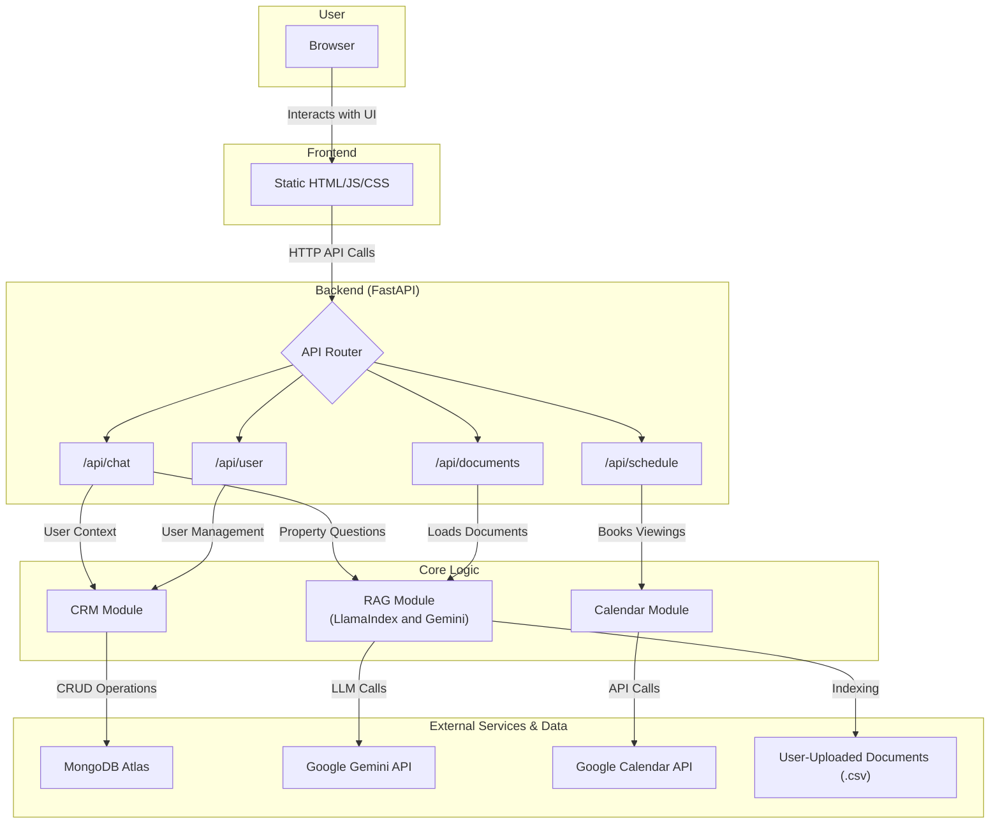

# Okada Leasing Agent AI

This project is an intelligent leasing agent powered by a FastAPI backend and a vanilla JavaScript frontend. The agent uses a Retrieval-Augmented Generation (RAG) system with a hybrid search mechanism to answer user questions about property listings. It also features a MongoDB-based CRM to manage user information and conversation history.

## Key Features

- **Intelligent Chatbot**: A conversational AI that can answer complex questions about property listings using a RAG pipeline.
- **Hybrid Search**: Combines semantic (vector) search and keyword (BM25) search for accurate and relevant context retrieval.
- **Dynamic Intent Recognition**: The chatbot can differentiate between property inquiries, scheduling requests, and general conversation.
- **User & Conversation Management**: A MongoDB-backed CRM stores user profiles, preferences, and full conversation histories.
- **Document Processing**: Users can upload CSV files of property listings, which are automatically indexed and integrated into the RAG system in the background.
- **Event Scheduling**: The chatbot can assist with scheduling property viewings.
- **Fully Asynchronous**: Built with FastAPI and async libraries for high performance.

## Tech Stack

- **Backend**: FastAPI, Uvicorn
- **AI/ML**: LlamaIndex, Google Gemini (Flash & Embedding Models)
- **Database**: MongoDB (Motor async driver)
- **Frontend**: Vanilla JavaScript, HTML5, CSS3
- **Core Libraries**: Pandas, Pydantic

---

## Application Architecture

The diagram below illustrates the flow of data and interaction between the system's components.



## Project Setup

Follow these instructions to get the project running locally.

### Prerequisites

- Python 3.10+
- A Google Gemini API Key
- A MongoDB instance (local or a free cloud instance like MongoDB Atlas)
- A Google Cloud project with the Calendar API enabled and a `credentials.json` file for a service account.

### 1. Clone the Repository

```bash
git clone <your-repository-url>
cd okada-leasing-agent
```

### 2. Set Up a Virtual Environment

It's highly recommended to use a virtual environment to manage dependencies.

**On Windows:**
```powershell
python -m venv venv
.\venv\Scripts\Activate.ps1
```

**On macOS/Linux:**
```bash
python3 -m venv venv
source venv/bin/activate
```

### 3. Install Dependencies

Install all the required Python packages from the `requirements.txt` file.

```bash
pip install -r requirements.txt
```

### 4. Configure Environment Variables

Create a file named `.env` in the root of the project directory. You can copy the `.env.example` file to get started:

```bash
# For Windows
copy .env.example .env

# For macOS/Linux
cp .env.example .env
```

Now, open the `.env` file and add your secret keys and database connection details.

```env
# .env
GOOGLE_API_KEY="YOUR_GEMINI_API_KEY"
MONGO_URI="YOUR_MONGODB_CONNECTION_STRING"
MONGO_DB_NAME="okada_leasing_agent"
GOOGLE_CALENDAR_CREDENTIALS_PATH="path/to/your/credentials.json"
```

### 5. Google Calendar Setup

To allow the application to schedule events, you must:
1.  **Enable the Google Calendar API** in your Google Cloud project.
2.  **Create a Service Account** and download its credentials as a JSON file (e.g., `credentials.json`).
3.  **Place the `credentials.json` file** somewhere accessible on your computer and put the full path to it in your `.env` file.
4.  **Share your primary Google Calendar** with the service account's email address (found inside `credentials.json`). You must grant it "Make changes to events" permissions.

---

## Running the Application

### 1. Start the Backend Server

Launch the FastAPI application using Uvicorn.

```bash
uvicorn app.main:app
```

The server will start, and you should see output indicating it's running on `http://127.0.0.1:8000`.

### 2. Open the Frontend

Open your web browser and navigate to:

[http://127.0.0.1:8000/](http://127.0.0.1:8000/)

You will be greeted with the user sign-up/login modal. Once you log in, you can start interacting with the chatbot.
